# **Predictive Analytics**

The focus on this exam is on the **application of the theory** covered in exam SRM to solve a real-world business problem. The exam is fully written, thus **communication** is also a big part of the exam. Thus, this set of notes will only cover content **new to PA**, mainly covering problem solving and data handling. Kindly refer to the exam SRM section for all theory related content.

## **Business Context**

The exam will involve a short write-up to **explain the business problem**. Generally speaking, the core problem can be categorized as one of the following:

* **Descriptive Analytics**: What happened in the **past**; focus on explaining **trends and relationships** between variables
* **Predictive Analytics**: What will happen in the **future**; focus on making accurate **predictions**
* **Prescriptive Analytics**: **Impact** of certain actions; focus on identifying the **best course of action**

!!! Tip

    The questions in the exam WILL make reference to the business context to some extent, thus constantly make reference back to the preamble to ensure key information is not missed.

!!! Warning

    Although the name of the exam is "Predictive Analytics", the exam can focus on **any type of anlytics**. It is common for different parts of the question to focus on different types of analytics, thus do NOT make any assumptions.

Every exam will also come with a **dataset** that accompanies the business problem. For recent exams, the actual dataset is no longer given, only a **Data Dictionary** that summarizes the following for each variable:

1. Name
2. Description - business specific context is provided here
3. Type
4. Numeric Range or Factor Levels

<!-- Obtained from SOA 202504 PA Exam -->
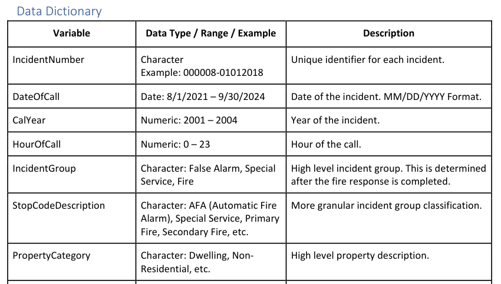{.center}

!!! Note

    For the purposes of this exam, it is assumed that only **structured** data will be used; data that can be fit into a **tabular arrangement** and hence easily manipulated.
    
    The opposite would be **Unstructured** data that CANNOT be placed into a table (EG. Image, Audio of Free Text) data. Although these data types provide **more insight**, they are much more **resource intensive** to process and require more **complicated models** to use.
    
    Another reason is that using free text as a factor variable will lead to a large number of levels (due to each one likely being distinct), which will definitely overfit the model.

!!! Warning

    One problem that might arise is the business context is that the mapping of the data is **not consistent over time**. There might have been a **change in business needs over time** to store information differently, which is why certain variables for the same population might change over time.

## **Data Adequacy**

### **Data Collection**

For all statistical analyses, it is important that there is **sufficient data** that is:

1. **Representative** of the underlying population - Use proper **sampling methods**
2. **Indicative** of future behaviour - Use data that has been collected **recently**; exclude observations that were impacted by **one-off events** (EG. COVID19)

!!! Note

    Naturally, the actual population of interest should be sampled. However, if there is an **insufficient or difficult to obtain** data, a relatively larger **proxy dataset** can be used instead, provided that it shares **similar key traits** with the population. However, there are some inherent limitations:
    
    * There might be **conditions unique to each population** which makes them slightly different from one another
    * The data might have a **different scope or granularity** than the target population

There are two main sampling methods that should be used:

* **Random Sampling**: Randomly draw observations from the **entire population**; best when population is **homogenous**
* **Stratified Sampling**: Randomly draw observations from **systematically divided groups**; best when population has **subgroups**

|         **Random Sampling**          |       **Stratified Sampling**        |
| :----------------------------------: | :----------------------------------: |
|        From entire population        |  From systematically divided groups  |
| Better when population is homogenous | Better when population has subgroups |
|         Easier to implement          |       More costly to implement       |

Detailed steps for stratified sampling:

* Systematically divide the population into **non-overlapping strata** (groups)
* **Randomly sample** a **proportionate number** of observations from each strata based on size
* **Combine** all of them to form the stratified samples
* **Stratification variable(s)** must be identified; the variables to split the population by
* For instance, if both variable A and B are chosen which have 10 and 4 levels respectively, then **40 levels** are needed to capture **all possible combinations** of the two (10*4)

!!! Tip

    Sampling methods can also be used to split the overall data into the train and test data. Stratified sampling tends to be better as it will ensure that the mix of observations is the same within the train and test data, leading to more precise test estimates. vc

A potential problem during the data collection process is **Sampling Bias**, which is unintentionally introducing bias via the means of collecting the sample:
    
<!-- Obtained from Scribbr -->
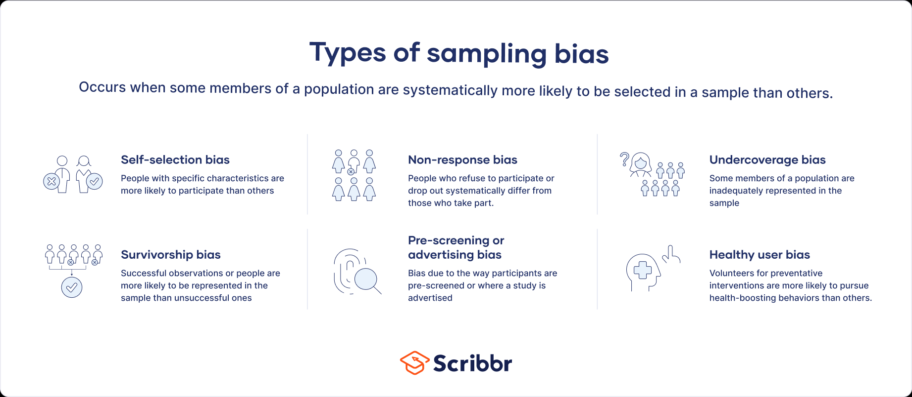{.center}

!!! Note

    Other considerations when collecting data:

    * **Personally Identifiable Information** (PII): Should only be collected **within terms and conditions**; should be **anonymized** and sufficiently **secured**
    * **Sensitive Information**: Should not collect variables (or proxies of them) that may lead to **unfair discrimination** (EG. Race, Disability status etc)

### **Data Adequacy**

The first aspect to consider is the **Scope** of the entire suite of variables provided:

* **Amount** - Ideally a large amount provided
* **Type** - Ideally both Numeric & Factor variables are provided
* **Granularity** - Ideally should have sufficient granularity (EG. Numeric - Decimal places, Factor - Number of levels)
* Must have variables **key to the business problem**; call out potentially missing ones
* Any possible **Target Leakages** - variables that provide information about the target that would **otherwise not be available** during actual deployment of the model

!!! Note

    Target leakage typically occurs for variables that are *generated* at the **same time or after** the target variable. Note that this refers to the GENERATION of the data, NOT the collection.

    If included, these variables would **artifically boost model performance** as they would not be present in practice. Thus, it is best NOT to collect such variables at all.

    For instance, if the model is aiming to predict whether a patient would be re-admitted, then using a variable such as "blood sugar level during next visit" would be a case of target leakage because the variable would only have values for patients who ARE re-admitted.

Another aspect to consider the **reasonableness** of each individual variable:

* Are they any **outliers**? Compare the mean relative to the minimum or maximum values
* Are there any **missing values**? Observe the count of missing values
* Are there any **impossible values**? Consider the business context

On impossible values, it is important to consider if there are any unlikely (but still possible) scenarios where the values **could be correct**; exceptional business cases.

After identifying the problems, the following actions can be taken:

* **Remove the affected observations** (Error across few observations - data can still be reasonably used)
* **Remove the entire variable** (Error across many observations - data cannot be reasonably used)
* **Impute the observation** (Error is systematic - allows for good approximation)

Alternatively, if the measurement of the variable is out of the business' control or its contextual significance to the data is small, then the problem can simply be **ignored**; place **focus on more important aspects**.

!!! Warning

    Note that any dropping of observations or variables will result in a loss of data.

### **Data Exploration**

The data should be explored to gain a better understanding of it. There are two primary methods to do so:

<!-- Self made -->
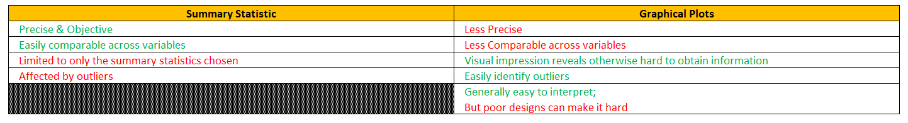{.center}

For summary statistics, the following statistics are usually provided as they are the output of the `summary` function in `R`:

* **Numeric**: Various statistics (not limited to the ones shown below)
* **Factor**: Count for each level

<!-- Obtained from Coaching Actuaries -->
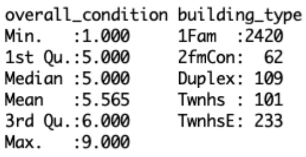{.center}

!!! Warning

    Naturally, counts are not available for numerical data given that there are infinitely many possibilities. This argument also applies to why histograms are not available for numeric data without binning.

For graphical plots, one or more of the following plots are typically used. It is important to note that there is **no universally best plot**. Each plot has a limitation, which typically stems from one of the following reasons:

* **Ease of visual interpretation** - certain shapes are **more palatable** than others for comparisons across levels or time
* **Flexibility** - certain plots have the option to include **other variables** in its plot (Split by levels, colour, shape, size)

<!-- Self Made-->
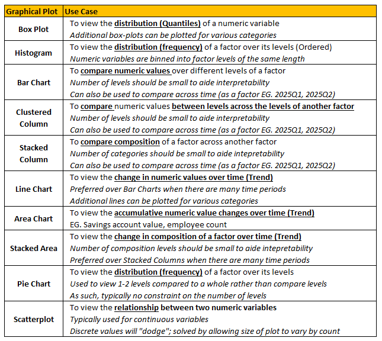{.center}

!!! Note

    One other inherent limitation of plots is their **inherent function**. Each type of plot is mainly used for one thing - it cannot illustrate what it cannot.

For plots illustrating **one main variable** (typically distribution plots), it is typical to take note of the following items:

* **Range** - Is the variable positive only?
* **Outliers** - Are there many outliers?
* **Mode** - Where is the data concentrated?
* **Skewness** - How symmetric is the distribution?

!!! Note

    Distribution plots provide similar information to the Summary statistics, but can provide more insight on aspects that are better visualized (EG. Skewness and Mode).

For plots with **two main variables**, there are generally two variations:

* **Target vs Predictor**: To find potential predictors 
* **Predictor vs Predictor**: To identify potential collinearity

!!! Warning

    When finding potential predictors, the key consideration is that the exhibited relationship (if any) should hold **across the entire range** of the predictor (numeric or ordinal categorical).

Another method of adding an **additional factor variable** to the plot is via **Faceting**. Instead of just one plot, it creates **small multiples** of the plot, each for a different level of the additional factor variable:

* For plots with **only one main variable**, this allows us to observe the **relationship between** two variables
* For plots with **two main variables**, this allows us to observe **how the relationship changes** in the presence of another variable (Interaction effects)

<!-- Obtained from Stackoverflow -->
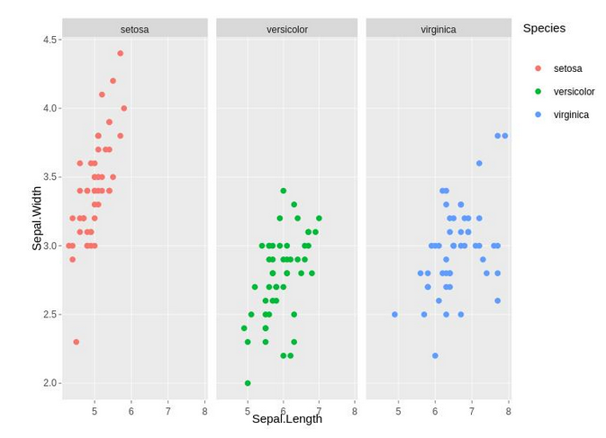{.center}

!!! Tip

    Faceting is NOT the only way to view interaction effects. If there is a non-traditional element of the graph that can be used to represent another variable, then a two variable plot may be able to **inherently illustrate** interaction effects:

    <!-- Obtained from Penn State Uni -->
    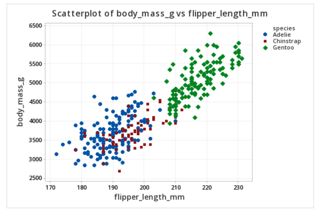{.center}

    For most most graphical features, it is typically limited to Categorical Variables - but so is faceting, so no major disadvantage. However, it **might be easier to compare** across levels when faceting since the entire plot will be side by side.

The following aspects are key considerations:

* **Axis Labels**: Should be clearly labelled
* **Chart Title**: Should be clearly labelled
* **Distinction of features**: Should be chosen such that they are easily distinguishable (EG. Different colours rather than shades of the same colour)
* **Axis Scale**: Should be chosen to best represent the data

!!! Warning

    If the data contains **outliers**, then the resulting **scale of the graph might be distorted**, resulting in an unfamiliar looking graph. For instance, the following is a boxplot that has been distorted:

    <!-- Obtained from Past SOA Exam Papers -->
    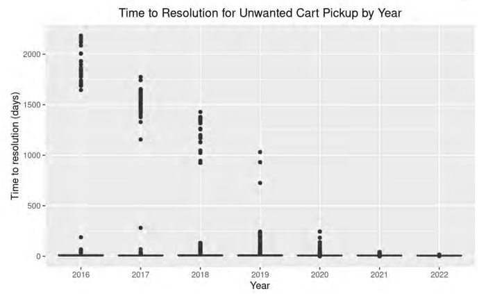{.center}

### **Data Transformation**

This process of transforming the original variables into a more useful format is a form of feature generation which helps to improve interpretability. 
If there are any aspects of the data that are not suitable for modelling, they will need to be transformed to fix the issue.

For numeric variables, there are relatively straightforward considerations:

* **Outliers** can be removed by trimming a proportion of the largest or smallest values
* **Concave transformations** can be used to compress values together to solve Skewness, Heteroscedasticity and also Linearize exponential relationships
* **Centering and Scaling** may also be needed for unsupervised methods, but note that it **does NOT solve Skewness**

!!! Warning

    Recall that concave transformations compress large values more than smaller values; thus can be used to solve ONLY right skewness:

    <!-- Obtained from Quanitfying Health -->
    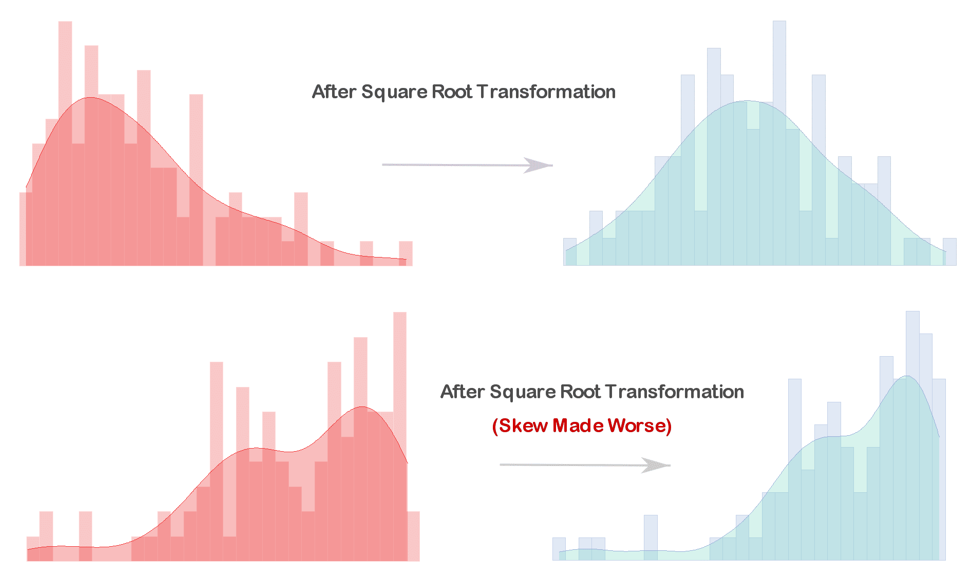{.center}

The main issue for numeric variables is **Skewness**, often due to outliers. If the outliers are due to a legitimate error, then they should be **removed**. Otherwise, it is possible to use the **concave transformations** (Log & Squareroot) to reduce the skewness. Note that these are **positive only transformations (no zeroes)**, thus a small constant should be added to the data in the event it has 0s. 

!!! Note

    Generally speaking, predictions on the untransformed variables should be **better as it follows the original distribution**. Predictions on transformed data (in the context of Skewness) results in smaller predictions, reflecting that the skewness has been transformed away.

!!! Note

    Combining variables

For Factor variables, there are a whole host of considerations:

* Levels with relatively relatively **small mix** should be **combined**, since there is no credible data to begin with. However, if the factor is already overwhelmingly dominated by a specific level, then **combining the levels has no use**; in fact **keeping the variable has no use** since there it has no predictive power
* Levels that clearly have **no relationship** to the target variable should also be **combined**, since they will only result in overfitting
* **Similar levels** should also be **combined** to increase the **interpretability** of the model 
* **Re-levelling** the reference level to the **most common level** is usually recommended, but it is also useful to relevel to the **lowest or highest level** in an ordinal variable for better interpretation
* **Binarization** converts each level into its own variable, which allows each level to be **included based on its own merit** (not bound by hierarchical)
* Combining factor variables together **reduces interpretability** of the *variable itself* but may allow the model to become more intepretable ONLY if the total number of levels have decreased as a result

!!! Warning

    Recall that the learning methods are assume to automatically binarize during the fitting process. The difference is that **manual binarization** might use a different reference level, which may result in a **completely different model** altogether - they are NOT simply interchangeable.

Another common issue is deciding whether or not to express discrete numeric variable (with few levels) as **numeric or a factor**. There are several key considerations:

* Are the values of the variable **fixed**? If during the production, the values of the variable will **always be within the existing range**, then it can modelled as a factor. However, if the values can be **varied beyond the existing range** (EG. Year - 2026 to 2020 in the data, but want to use 2020+ in production), then it should be used as a Numeric variable to allow the model to **extrapolate** the effects
* Does the variable need to have **numeric operations** performed? If so, it should be naturally kept as a numeric variable
* Is the relationship with the target **monotonic**? If not, then converting it to a Factor would allow the model to have more **complex relationships**. Similarly, it allows for each level to be **examined seperately** for their significance
* Is the model prone to **overfitting**? If so, then converting it to a factor will **increase the total number of variables**, worsening the problem

!!! Note

    Non-discrete Numeric variables can be converted into Factors using:

    * **Binning**: Grouped into groups of equal width over the range
    * **Clustering**: Grouped into Cluster groups

    These methods will inevitably result in a **loss of information** going from a precise variable to a broader group. However, this could lead to greater interpretability as it might be easier to explain the effect of a group rather than a continuous variable.

## **Model Selection & Evaluation**

The specific details of each model can be found in the SRM section. This section will briefly summarize the **differences** across the different learning methods to better understand which model is best for a given situation:

<!-- Self Made -->
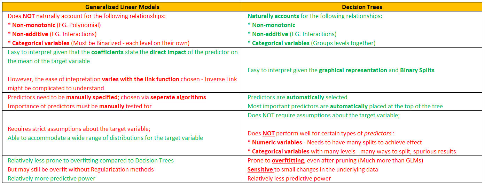{.center}

<!-- Self Made -->
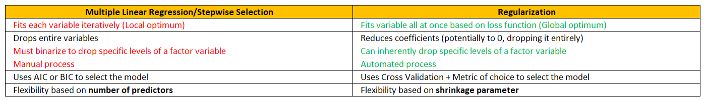{.center}

<!-- Self Made -->
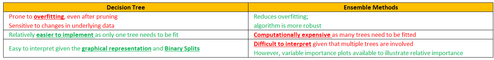{.center}

<!-- Self Made -->
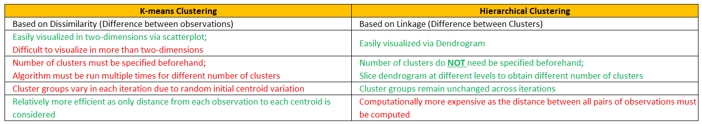{.center}
