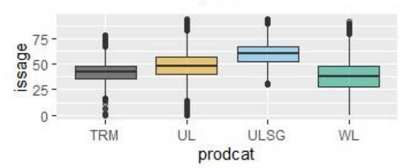

# **Predictive Analytics**

The focus on this exam is on the **application of the theory** covered in exam SRM to solve a **real-world business problem**. The exam is fully written, thus **communication** is also a big part of the exam. Thus, this set of notes will only cover content **new to PA**, mainly covering problem solving and data handling. Kindly refer to the exam SRM section for all theory related content.

The questions in the exam WILL make reference to the business context, thus constantly make reference back to the preamble to ensure key information is not missed.

Every exam will also come with a **dataset** that accompanies the business problem. For recent exams, the actual dataset is no longer given, only a **Data Dictionary** that summarizes the following for each variable:

1. Name
2. Description - business specific context is provided here
3. Type
4. Numeric Range or Factor Levels

<!-- Obtained from SOA 202504 PA Exam -->
{.center}

!!! Warning

    One problem that might arise is the business context is that the mapping of the data is **not consistent over time**. There might have been a **change in business needs over time** to store information differently, which is why certain variables for the same population might change over time.

## **Problem Solving**

Firstly, we must understand the different **types of problems** out there:

* **Descriptive**: What happened in the **past**; focus on explaining **trends and relationships** between variables
* **Predictive**: What will happen in the **future**; focus on making accurate **predictions**
* **Prescriptive**: What is the **best course of action**; focus on **making decisions**

!!! Warning

    SOA mentions that all three can also be referred to collectively as "Predictive Analytics" (which is why the exam is named this way). Thus, the exam will likely feature all of the above analytic types in some form.

There are 6 general characteristics of predictive modelling problems:

1. Business issue can be **clearly defined**
2. The issue can be further broken down into a **few well-defined questions**
3. **High quality data** to address the questions are **readily available**
4. The predictions will likely **aide understanding or result in actions taken**
5. The solution is likely **better than other existing problems**
6. It will be possible to **maintain, monitor and update the model** over time

The essence of the above characteristics is that predictive analytics (as a whole) is a specialized approach that **requires significant effort**. If it **cannot be used to its full potential** (lack of data, lack of action, unable to update) or if there are **equally effective alternatives** that are simpler, then predictive analystics should not be used.

Next, we must **define the problem**:

* Identify the **root cause** of the problem
* Develop **testable hypotheses**
* Develop **Key Performance Indicators** (KPI) that are:
    * Aligned with the clients business strategy
    * Objective & easily measurable from the data

We must also consider the **feasibility** of the a predictive approach:

* **Data issues** (Implemenation) - Availability, quality, longevity or other related issues
* **Other solution** (Post-Implementation) - Regulatory risk, public backlash, gaming risk

Lastly, it is important to know what should come after the developing the model:

* Fine tune business problem accordingly
* **Consult subject matter experts** for insights or validation
* **Gather more data** to enhance the analysis
* **Refine** existing models or **apply new types of models**
* **Field test the model** in a real-world scenario
* **Terminate the model** (cut loss) if there are no insights to be brought

!!! Tip

    Naturally, some of the above could be applied DURING model development itself, it does not need to be done strictly after.

## **Data Definition**

For the purposes of this exam, there are two broad groups of data, determined by whether or not that they can be stored in a table. Tables have clearly defined rows and columns which makes them easy to work with it.

|     **Structured**     |  **Unstructured**   |
| :--------------------: | :-----------------: |
|     Tabular format     | Non-tabular format  |
| EG. Numbers or Factors | EG. Image or Audio  |
|   Easily accessible    | Difficult to access |
|     Less flexible      |    More flexible    |

!!! Note
    
    For the purposes of this exam, free text is considered a form of unstructured data. Only factors are considered structured.

Rows of the tables are known as **Observations** while Columns are known as **Variables**. There are two groups of variables we are interested in:

* **Target Variable**: What the model is trying to predict
* **Predictor Variable**: What the model uses to predict

!!! Tip

    It is possible that the problem requires more than one target variable. In such cases, it is possible to combine them such that only a **single model** is required. However, it is recommended to **seperately model each** to better understand how each component is affected.

There are generally two types of variables:

* **Numeric** - Continuous or Discrete 
* **Factors** - **Fixed enumeration** of values known as Levels (Discrete Numeric or Text)

!!! Tip

    There are a special category of each kind of variable:

    * **Numeric** - Time, Date or Geospatial data
    * **Factors** - Boolean (True or False only) or Ordinal (Ordered levels)

## **Data Design**

A model is only is as good as the data put into it. Thus, it is important to have **strong data design** to ensure that the data best reflects that environment that we are trying to predict.

Firstly, we generally assume that historical data will predict the future. However, there are **several considerations** on how far back to go, balancing the need for a reasonably large dataset:

* Recent history is more representative of the future
* One-off events may not be indicative events
* Key developments in the past that changed the environment

Next is **Sampling**, which is the process of obtaining the data:

* **Random Sampling**: Randomly draw observations from the **entire population**; best when population is **homogenous**
* **Stratified Sampling**: Randomly draw observations from **systematically divided groups**; best when population has **subgroups**
* **Systematic Sampling**: Draw observations from the entire population in a **periodic pattern**

|         **Random Sampling**          |       **Stratified Sampling**        |
| :----------------------------------: | :----------------------------------: |
|        From entire population        |  From systematically divided groups  |
| Better when population is homogenous | Better when population has subgroups |
|         Easier to implement          |       More costly to implement       |

Detailed steps for stratified sampling:

* Systematically divide the population into **non-overlapping strata** (groups)
* **Randomly sample** a **proportionate number** of observations from each strata based on size
* **Combine** all of them to form the stratified samples
* **Stratification variable(s)** must be identified; the variables to split the population by
* For instance, if both variable A and B are chosen which have 10 and 4 levels respectively, then **40 levels** are needed to capture **all possible combinations** of the two (10*4)

Although we usually refer to drawing from the population, sampling methods can be used to draw from an existing dataset to **form another smaller one**. For instance, to form the **training and test sets**. This can help to ensure that the mix of observations inside the training and test set are reasonably similar.

!!! Warning

    A potential problem during the data collection process is **Sampling Bias**, which is unintentionally introducing bias via the means of collecting the sample:
    
    <!-- Obtained from Scribbr -->
    {.center}

!!! Note

    Naturally, the actual population of interest should be sampled. However, if there is an **insufficient or difficult to obtain** data, a relatively larger **proxy dataset** can be used instead, provided that it shares **similar key traits** with the population. However, there are some inherent limitations:
    
    * There might be **conditions unique to each population** which makes them slightly different from one another
    * The data might have a **different scope or granularity** than the target population

Next is **Granularity**. It is the **precision** at which variables are measured (EG. Country vs City level). Different levels of granularity could result in different performances. Generally, as long as the data **has the highest level of granularity**, it can be combined to form lower levels of granularity as needed.

Last is the possibility of a **Target Leakage**. Variables that provide information about the target that would **otherwise not be available** during actual deployment of the model. It typically occurs for variables that are *generated* at the **same time or after** the target variable. If included, these variables would **artifically boost model performance** as they would not be present in practice. Thus, it is best **NOT to collect such variables at all**.

!!! Note

    Other considerations when collecting data:

    * **Personally Identifiable Information** (PII): Should only be collected **within terms and conditions**; should be **anonymized** and sufficiently **secured**
    * **Sensitive Information**: Should not collect variables (or proxies of them) that may lead to **unfair discrimination** (EG. Race, Disability status etc)
    * **Relevance**: Should only collect variables that are potentially related to the business problem

## **Data Exploration**

### **Univariate**

Data is represented by its values. Thus, we need to understand its values and how they spread out; its **distribution**. Unfortunately, it is impossible to understand the distributions by just merely looking at the raw values. Thus, we need to make use of either:

* Summary Statistics - EG. Mean & Variance (Numeric), Frequency (Factor)
* Graphical Visualizations - EG. Histogram & Boxplot (Numeric), Bar Chart (Factor)

!!! Warning

    Naturally, counts are not available for numerical data given the infinitely many possibilities. This argument also applies to why histograms are not available for numeric data without binning.

!!! Warning

    Boxplots dont technically show the distribution of the values, but rather a visual summary of certain key statistics. It is good at identifying outliers.

<!-- Self made -->
{.center}

For graphical plots, one or more of the following plots are typically used. It is important to note that there is **no universally best plot**. Each plot has a limitation, which typically stems from one of the following reasons:

* **Ease of visual interpretation** - certain shapes are **more palatable** than others for comparisons across levels or time
* **Flexibility** - certain plots have the option to include **other variables** in its plot (Split by levels, colour, shape, size)

<!-- Self Made-->
{.center}

<!-- Obtained from SOA Modules -->
{.center}

!!! Note

    One other inherent limitation of plots is their **inherent function**. Each type of plot is mainly used for one thing - it cannot illustrate what it cannot.

For plots illustrating **one main variable** (typically distribution plots), it is typical to take note of the following items:

* **Range** - Is the variable positive only?
* **Mode** - Where is the data concentrated?
* **Outliers** - Are there many outliers?
* **Skewness** - How symmetric is the distribution?

!!! Note

    Distribution plots provide similar information to the Summary statistics, but can provide more insight on aspects that are better visualized (EG. Skewness and Mode).

Essentially, the model needs to have a **good spread of data across the board** to have a good fit. If the data is **clustered in one area** or there is a **skew**, then the model fits very well to that clustered region but performs **poorly outside of it** - unreliable coefficient estimates/becomes high leverage points.

### **Bivariate**

Next is to understand the relationships between variables. However, it is not possible to examine every possible pairwise relationship. Thus, only well-known or potentially interesting relationships should be examined.

* **Target vs Predictor**: To find potential predictors 
* **Predictor vs Predictor**: To identify potential collinearity

!!! Warning

    When finding potential predictors, the key consideration is that the exhibited relationship (if any) should hold **across the entire range** of the predictor (numeric or ordinal categorical).

Another method of adding an **additional factor variable** to the plot is via **Faceting**. Instead of just one plot, it creates **small multiples** of the plot, each for a different level of the additional factor variable:

* For plots with **only one main variable**, this allows us to observe the **relationship between** two variables
* For plots with **two main variables**, this allows us to observe **how the relationship changes** in the presence of another variable (**Interaction effects**)

<!-- Obtained from Stackoverflow -->
{.center}

!!! Tip

    Faceting is NOT the only way to view interaction effects. If there is a non-traditional element of the graph that can be used to represent another variable, then a two variable plot may be able to **inherently illustrate** interaction effects:

    <!-- Obtained from Penn State Uni -->
    {.center}

    For most most graphical features, it is typically limited to Categorical Variables - but so is faceting, so no major disadvantage. However, it **might be easier to compare** across levels when faceting since the entire plot will be side by side.

Some other key considerations on chart design:

* **Axis Labels**: Should be clearly labelled
* **Chart Title**: Should be clearly labelled
* **Distinction of features**: Should be chosen such that they are easily distinguishable (EG. Different colours rather than shades of the same colour)
* **Axis Scale**: Should be chosen to best represent the data

!!! Warning

    If the data contains **outliers**, then the resulting **scale of the graph might be distorted**, resulting in an unfamiliar looking graph. For instance, the following is a boxplot that has been distorted:

    <!-- Obtained from Past SOA Exam Papers -->
    {.center}

## **Data Transformation**

For the purposes of this exam, there is a distinction between:

* **Variables** - Referring to raw data
* **Features** - Referring to **derivations** from the raw data or **cleaned versions** of raw data

### **Feature Generation**

Feature generation & selection is important is because it is not realistic to use ALL the variables available to make the prediction. It is important to transform the original variables into a **more useful form** that will allow the model to **pick up the information more effectively**. Following the principle of parsimony, if there exists an otherwise equally capable model, the **simpler model** (with fewer inputs) should be used (Occam's Razor).

**Numeric Variables**:

* **Binning**: Grouping numeric values over equal ranges
* **Non-supervised learning** methods (PCA, Clustering)

!!! Note

    They will inevitably result in a **loss of information** going from a precise variable to a broader summary. However, this could lead to greater interpretability as it might be easier to explain the effect of a group rather than specific values of a continuous variable.

**Discrete Numeric Variables** - Convert to Factor?

* **Fixed Range**: Convert only if the current spread contains all possible values and **will not change** (EG. Numeric labels)
* **Numeric Operations**: Convert only if no **numeric operations** need to be performed on the variable
* **Non-Monotonic Relationship**: Convert to allow the **non-monotonic relationship** to be expressed (across possible interactions)
* **Overfitting**: Convert only if the model is not already overfitting as Factors **increases the total number of variables**
* **Interpretation**: Convert only if interpretation is not priority (**Linear is easier to interpret**)
* **Sample Size**: Convert only if there is **sufficient observations** in each level to ensure reliable estimates

!!! Note

    On the point on fixed range, consider the Year Variable. If the training data only has years from 2015 to 2020, then the model can only accept 2015 to 2020 as the input for year if it was treated as a Factor - it cannot be used to predict future years.

**Factor Variables**:

* **Binarization**: Converts each level into its own variable, which allows each level to be **included based on its own merit** (not bound by hierarchical principle)
* **Re-levelling**: Changing the reference level to the **most common level** or the **lowest or highest level** for better interpretation
* **Combining Levels**: Grouping levels that are similar, small or have no relationship with the target
* **Compound Factors**: Combining two or more factor when it leads to overall reduction in levels (not all combinations of levels exist)

!!! Warning

    If a factor is already overwhelmingly dominated by a specific level, then **combining the levels has no use**; in fact **keeping the variable has no use** since there it has no predictive power, thus it should be removed.

!!! Warning

    Recall that MLR IS assumed to automatically binarize during the fitting process. The difference is that **manual binarization** might use a different reference level, which may result in a **completely different model** altogether - they are NOT simply interchangeable.

### **Cleaning**

Consider the **reasonableness** of each individual variable:

* Are they any **outliers**? Compare the mean relative to the minimum or maximum values
* Are there any **missing values**? Observe the count of missing values
* Are there any **impossible values**? Consider the business context

On impossible values, it is important to consider if there are any unlikely (but still possible) scenarios where the values **could be correct**; exceptional business cases.

For variables with Outliers/Skewness:

* **Outliers** can be removed by trimming a proportion of the largest or smallest values
* **Concave transformations** can be used to compress values together to solve Skewness, Heteroscedasticity and also Linearize exponential relationships
    * Note that these are **positive only transformations (no zeroes)**, thus a small constant should be added to the data in the event it has 0s to prevent errors
* **Dummy Variables** can be used to ignore the effects of values past a certain threshold

!!! Warning

    Recall that concave transformations compress large values more than smaller values; thus can be used to solve ONLY right skewness:

    <!-- Obtained from Quanitfying Health -->
    {.center}

!!! Note

    Generally speaking, predictions on the untransformed variables should be **better as it follows the original distribution**. Predictions on transformed data (in the context of Skewness) results in smaller predictions, reflecting that the skewness has been transformed away.

For observation with missing or incorrect values:

* **Remove the affected observations** (Error across **few observations** - data can still be reasonably used)
* **Remove the entire variable** (Error across **many observations** - data cannot be reasonably used)
* **Impute the observation** (Error is **systematic** - allows for good approximation)
* Alternatively, if the measurement of the variable is out of the business' control or its contextual significance to the data is small, then the problem can simply be **ignored**; place **focus on more important aspects**

!!! Warning

    Note that any dropping of observations or variables will result in a loss of data.

## **Model Selection & Evaluation**

The specific details of each model can be found in the SRM section. This section will briefly summarize the **differences** across the different learning methods to better understand which model is best for a given situation:

<!-- Self Made -->
{.center}

<!-- Self Made -->
{.center}

<!-- Self Made -->
{.center}

<!-- Self Made -->
{.center}
