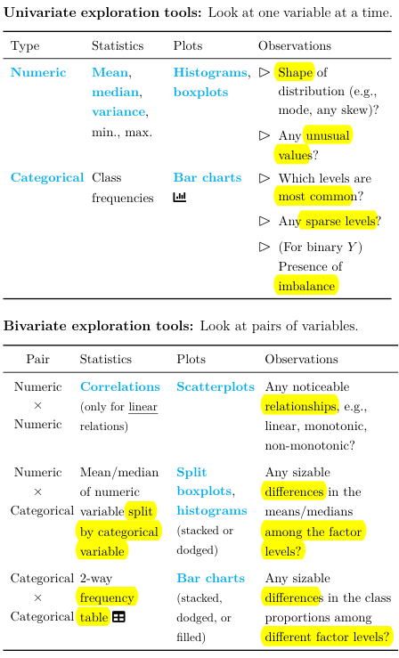
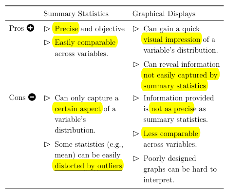
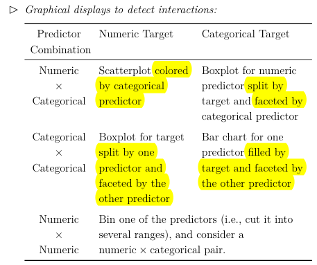
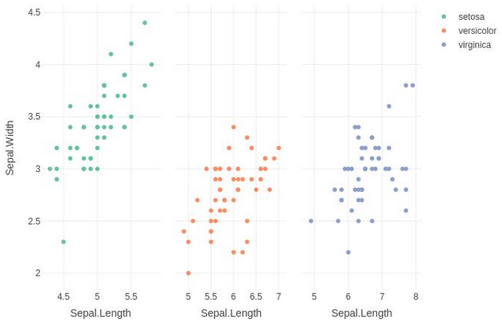

# **Predictive Analytics**

## **Overview**

The focus on this exam is on the **application of the theory** covered in exam SRM to solve a real-world business problem. The exam is fully written, thus **communication** is also a big part of the exam.

Thus, this set of notes will only cover content **new to PA**, mainly covering problem solving and data handling. Kindly refer to the exam SRM section for all theory related content.

For the purposes of this exam, there are 6 parts to solving a business problem:

1. Identifying the problem
2. Collecting data to analyze the problem
3. Exploring the data to better understand it
4. Choosing and building a statistical model to solve the problem
5. Validating that the model is appropriate
6. Providing a recommendation for the problem

Parts (4) and (5) mainly rely on SRM content thus are not covered in this section. 

## **Problem Definition**

There are three main types of problems:

* **Descriptive**: What happened in the **past**; explaining **trends and relationships** between variables
* **Predictive**: What will happen in the **future**; making accurate **predictions**
* **Prescriptive**: Impact of **prescribed actions**; identifying the **best course of action**

In practice, a given problem will involve a **combination** of the above types of problems. As its name suggests, this exam focuses on **Predictive Problems**. There are two ways to create a meaningful predictive problem definitions:

* **Hypotheses**: Use prior knowledge to develop a **testable hypotheses** that addresses the concern
* **Metrics**: Create **objective and measurable KPIs** that are **aligned** with the business strategy

## **Data Collection and Validation**

For predictive analytics, it is important that the data collected is:

1. **Representative** of the underlying population - Use proper **sampling methods**
2. **Indicative** of future behaviour - Use data that has been collected **recently**; exclude observations that were impacted by **one-off events** (EG. COVID19)

!!! Note

    It is important that both the training and test set are made up of similar compositions. If the training set's composition is significantly different from the test set's, then it will produce an effect **similar to overfitting** where the model would be fit to the mix of the training data, which does not generalize well to the test data.

    Thus, it is important to ensure that the **composition between the two sets are similar** (especially for key variables), which will ensure that the resulting training and test estimates are more reliable. 

There are two main sampling methods that should be used:

* **Random Sampling**: Randomly draw observations from the population without replacement
* **Stratified Sampling**:
    * Systematically divide the population into **non-overlapping strata** (groups)
    * **Randomly sample** a **proportionate number** of observations from each strata based on size
    * **Combine** all of them to form the stratified samples

In order to divide the population into groups, **stratification variable(s)** must be identified; the variables to split the population by. For instance, if both variable A and B are chosen which have 10 and 4 levels respectively, then **40 levels** are needed to capture **all possible combinations** of the two (10*4).

!!! Tip

    The key advantage of random sampling is that each observation has an **equal chance** of getting drawn, thus tends to result in an **unbiased sample**.

    This is in contrast to another common method known as **Systematic Sampling**, which draws observations based on a **set pattern** (EG. Every n-th observation). While it ensures that the sample is **evenly spread throughout the population**, it is still **prone to bias** as the underlying data might have a **periodic pattern** that is not known.

    Nonetheless, it still remains a valid sampling method. It can also be combined with Stratified Sampling, where systematic sampling is used to sample within each strata.

A potential problem during the data collection process is **Sampling Bias**, which is unintentionally introducing bias via the means of collecting the sample:
    
* **Convenience Sampling** - People who are easy to sample may follow a certain trend (EG. Friends & Family)
* **Voluntary Response** - People are voluntarily respond tend to feel strongly about issues (EG. Customer Reviews)
* **Under Representation** - May unintentionally exclude certain groups (EG. Phone survey exclude those without phones)
* **Survivorship Bias** - Sampling only people who “survived” a process excludes those who didn’t
* The above is a non-exhaustive list

For the purposes of this exam, it is assumed that only **structured** data will be used; data that can be fit into a tabular arrangement and hence easily manipulated. The opposite would be **Unstructured** data that CANNOT be placed into a table (EG. Image or Audio) data. Although these data types provide **more insight**, they are much more **resource intensive** to process and require more **complicated models** to use.

!!! Warning

    For the purposes of this exam, it is also assumed that **free text** is a form of unstructured data.

There are some general considerations when collecting data:

* **Granularity**: Collected values should follow a **specified level of detail** (EG. Decimal places, date vs quarter)
* **Reasonableness**: Collected values must **make sense** (EG. Age should be non-negative, not larger than 120)
* **Consistency**: Collected values should follow the **same basis** (EG. Same units, same encoding)
* **Documentation**: **Accompanying notes** that describes the data in detail, the collection process and any irregularities observed
* **Personally Identifiable Information** (PII): Should only be collected **within terms and conditions**; should be **anonymized** and sufficiently **secured**
* **Sensitive Information**: Should not collect variables (or proxies of them) that may lead to **unfair discrimination** (EG. Race, Disability status etc)

For predictive analytics specifically, possible **Target Leakages** are of a key concern. They are variables that are **NOT available during actual deployment** of the model that contains **information about the target variable** ("leaks"). If included, these variables would **artifically boost model performance** as they would not be present in practice. Thus, it is best NOT to collect such variables at all.

!!! Note

    Target leakage typically occurs for variables that are *generated* at the **same time or after** the target variable. Note that this refers to the GENERATION of the data, NOT the collection.

    For instance, if the model is aiming to predict whether a patient would be re-admitted, then using a variable such as "blood sugar level during next visit" would be a case of target leakage because the variable would only have values for patients who ARE re-admitted.

## **Data Exploration**

Recall that there are two broad data categories - Numeric & Categorical. The method of exploration depends on the number of and type of variables:

<!-- Obtained from ACTEX PA Cheat Sheet -->
{.center}

<!-- Obtained from ACTEX PA Cheat Sheet -->
{.center}

<!-- Obtained from ACTEX PA Cheat Sheet -->
{.center}

!!! Warning

    The reason why frequency is not applicable for numeric data is that there are infinitely many possibilities, thus calculating the frequency for each is impractical and not meaningful.

!!! Tip

    For Bivariate analysis, when there are categorical variables involved, there are three variations that can be applied:

    * **Stacked**: Stacked column
    * **Filled**: 100% stacked column (Compare **across**)
    * **Dodged**: Clustered column (Compare **within**)

!!! Tip

    To split is to **add another visual** to the current chart, each representing a different category:

    <!-- Obtained from Stackoverflow -->    
    {.center}

    To facet is to **create multiples** of the current chart, each filtered by a different category:

    <!-- Obtained from Stackoverflow -->
    {.center}

!!! Note

    Numeric data should be **treated** as categorical when:

    * There are only a small number of distinct values
    * They are merely numeric labels with no order (EG. Group number)
    * They have a **complex relationship** with the target (Models have more flexibility to capture the relationship when it is categorical)

    Numeric data can also be **transformed** into Categorical ones by **grouping** them into **Bins**:

    * Factor Level 1: 0-10
    * Factor Level 2: 11-20
    * Factor Level 3: 20 and above

### **Data Transformation**

The main issue for numeric variables is **Skewness**, often due to outliers. If the outliers are due to a legitimate error, then they should be r**emoved**. Otherwise, it is possible to use the **concave transformations** (Log & Squareroot) to reduce the skewness.

The main issue for categorical variables is **high dimensionality** (too many levels) and **sparseness** (too few observations in certain levels). Both of this can be solved by **combining similar levels** together while ensuring that the resulting new levels properly split the data. This often requires **contextual knowledge** of the data.

This process of transforming the original variables into a more useful format is a form of feature generation which helps to improve interpretability. 

## Next Steps
