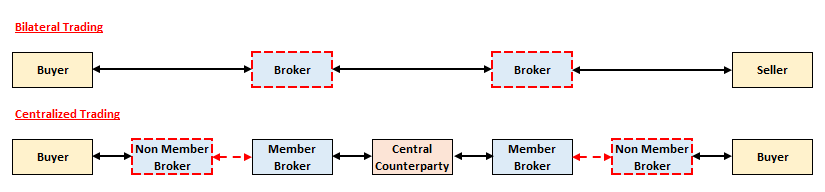

# **Introduction to Derivatives & Trading**

Derivatives are **financial contracts** between **two parties** that agree to a **future transaction(s)**. The value of the contract is **derived from** (hence the name) the value of an **underlying variable**:

* **Common Stock** - Unit of ownership in a company (EG. Apple stock)
* **Indices** - Metric to track the performance of a group of assets (EG. S&P500 which tracks the top 500 US companies)
* * **Commodities** - Raw materials, typically expressed in specific units (EG. Ounce of Metal, Bushel of Corn)
* **Foreign Currency** - Expressed relative to another currency
* **Interest Rates** - Expressed as a percentage

## **Trading Basics**

Key trading terminology:

* **Long position** - Benefit from **price increase**; buying an asset to later sell it
* **Short position** - Benefit from **price decrease**; **short-selling** an asset
* Entering an **identical long and short** position position will **close the position**

Short selling is the process of selling then buying:

* **Borrowing an asset** now with the promise of returning the asset later
* **Immediately selling** the asset to receive the current market price
* **Buying the asset back in a future time** to return the asset at the future market price
* Short seller gains when the price falls as they are able to restore the asset at a lower cost than what they borrowed it for

## **Payoff & Profit**

The **Payoff** of an asset is the **terminal net cashflow** that would be received at the time that they **close** the position. It does NOT take into account cashflows at any other time, most importantly the cost of entering the position. Thus, the payoff is akin the **revenue** of the position.

The **Profit** of an asset is simply the Payoff that accounts for cashflows that occur at other times, mainly the **cost** of entering the position. Profit must take into account the **time value of money**, thus all other cashflows are **accumulated at the risk free rate** to the time the position is closed.

The exact Payoff and Profit are not known beforehand because it is impossible to predict the future price of an asset. Thus, they typically expressed **mathematically** or via a diagram, known as a **Payoff or Profit Diagram**.

The payoff and profit for a long and short position are always **OPPOSITE** of one another.

!!! Tip

    For the purposes of this exam, it is assumed that interest is **compounded continuously**:
    
    * $r$ is the continuously compounded annual rate of interest
    * $T$ is the number of years (fractional)
    
    $$
        \text{FV} = Cashflow \cdot \exp{rT}
    $$ 

## **Trading Markets**

There are two main markets to trade derivatives:

|    **Exchange Traded Market**    |    **Over-the-Counter Market**    |
| :------------------------------: | :-------------------------------: |
|             Auction              |        Private Negotation         |
|   Standardized contracts only    | Standardized & bespoke contracts  |
|    Centralized clearing only     | Centralized or Bilateral clearing |
| More transactions, smaller sizes | Fewer transactions, larger sizes  |

**Bilateral** clearing refers to two counterparties **directly trading** with one another while **Centralized** clearing involves a **Centralized Counterparty** to step in and "break" the relationship between buyer and seller where:

* CCP will become the buyer to the seller
* CCP will become the seller to the buyer
* Form of **Novation** (contract replacement) where the original buyer and seller **no longer have a legal relationship**

Only CCP **broker members** can trade with the CCP. If the current broker is not a member, the business can be funneled through a member broker to get the trade cleared.

<!-- Self Made -->
{.center}

!!! Note

    Brokers also typically charge a **small commission** for each trade processed.

### **Market Makers**

Since CCPs only *replace* counterparties, there needs to have been an **original counterparty** in the first place. This is typically achieved through **Market Makers**, who **continuously buy and sell assets** (aiming to **sell for slightly more** than what it was bought for), readily acting as the counterparty to most trades, **providing liquidity** to the market.

!!! Warning

    Not all trades have market makers as a counterparty, it is possible to match with another trader.

    One market might have multiple market makers, so multiple trades might match with different market makers.

Key trading terminology:

* **Bid Price** - Amount that a **prospective buyer** would pay
* **Ask Price** - Amount that a **prospective seller** would require
    
The way to remember is that it is always from the perspective of the counterparty (Market Marker):
    
* Our buyer bids (Bid price = our selling price)
* Our seller asks (Ask price = our buying price)
    
The Bid and Ask prices listed on most platforms are typically the **highest Bid** and **lowest Ask** price of all the *open orders* on the platform. They are **best bid and ask prices** at the moment. However, even the best Bid price is **always lower** than the Ask price; the gap is known as the **Bid-Ask-Spread**. An easy way to remember is that it is in **ascending order** - the lower bid price comes first in the name.

!!! Note

    Intuitively, any prospective buyer and seller with overlapping bid and ask prices **would have already matched** and have their trades cleared. Thus, the *outstanding* orders would **NOT have matching bid and ask prices**, where bid is lower than ask (if not the trade would have cleared). The **Market Price** is therefore the last overlapping bid and ask price that matched.

In order to continuously provide bid and ask quotes, market makers have to **hold on to some level of inventory** of the traded asset - it is impossible to immediately find a new buyer for each seller, vice-versa. In doing so, they take on some **market risk** as the price of the stock could move adversely during this time. Thus, they charge a **risk premium** in their quotes, with Ask prices being higher than their bid prices, targeting to **earn the spread**.

* **Price Volatility** - Highly volatile stocks **increase the market risk** borne, increasing the spread
* **Liquidity** - Lower liquidity markets require require market makers to **hold onto the assets longer**, exposing them to more risk, increasing the spread
* **Competition** - Presence of other market makers will **decrease spreads** as each tries to win flows from each other

Market makers earn more when their trading volume (both buying and selling to offset the position) is higher. However, lowering the spread to gain more volume might result in insufficient funds to cover the risk, resulting in losses instead. Thus, many market makers are turning to **high frequency trading** to process trades faster, thus **winning orders from competition without having to compromise on spread**.

Most markets typically have **special arrangements** with market makers to **ensure liquidity** in the market. Most **large banks** typically act as market makers for commonly traded derivatives.

### **OTC Bilateral Trading**

Bilateral trading in OTC markets involve two parties directly dealing with each other. However, without a centralized entity to manage the trade, the two parties must **agree on the specific terms** of the contract. Most parties agree to use **standard contract template** known as a **Master Agreement** to minimize legal negotiations. The template is provided for by the **International Swaps and Derivatives Association** (ISDA) to make the OTC market safer and more efficient.

A major concern in these agreements is **Credit Risk** or **Counterparty risk** - the risk that the counterparty **does not fulfil its obligation** when it becomes due in the future.
 
This can be mitigated via the use of **Collateral**.
 
Mitigate via collater
 
 
### **Exchange Traded CCP**

### Systematic Risk

To understand the benefits of CCPs, it is important to first understand the risks of trading bilaterally:

* Each party is directly exposed to the **credit risk of their counterparty** (another instituition)
* If one party defaults, their counterparty is likely to **experience a loss**, which could **cause them to default** as well
* All **their counterparties** may experience losses and potentially default as well; so on and so forth
* This is known as **Systematic Risk**, where the default of one entity leads to a **ripple effect** that causes other entities to default as well, ultimately leading to a **collapse of the financial system**

CCPs centralize the structure, converting it into a **single point of failure** that is better positioned to be managed and hence less likely to result in a system wide collapse:

* Requires **Margin** for each trade; margin is a **form of collateral** to cover the potential losses or defaults
* Requires contribution to a **Guaranty Fund** that may be used when margin is insufficient in the event of a default
* These requirements increases the amount of collateral, which **reduces the likelihood of default**
* Since each party is less likely to default, the CCP itself is less likely to fail and hence **lower systematic risk**

### **Margin**

As mentioned, one of the primary methods that CCPs use to manage credit risk are via Margins. There are several key terminologies:

* **Initial Margin** (IM) - Amount that must be posted when **initially** entering the contract
* **Maintenance Margin** - **Minimum amount** required in the margin account to keep the contract in-force

 
* **Variation Margin** - Amount that is **added/subtracted** from the margin account to **reflect gains/losses**

* **Margin Call** - **Request to post more margin** when the margin account falls below the maintenance margin level

Margin requirements are determined by the CCP using **mathematical models**. Generally speaking, IM is set such that it can cover potential losses **99% of the time**; MM is typically set **around 75%** of the IM.

Changes in margins are typically calculated only once at the end of each trading day, known as a **Daily Settlement**. However, if there are large price movements during the day, margin can be calculated during the day itself (intraday)
Margin call anytime?

!!! Note

    The purpose of any form of collateral is to ensure that an entity does not default on its obligations. Thus, only derivatives which **imposes an obligation** on the contract owner require margin.
    
    An option holder has a right but no obligation to buy or sell, while an option write has an obligation (if exercised) to buy or sell. Thus, option writers are typically required to post margin while option holders are not.
    
!!! Warning

    Margin posted using an asset (rather than cash) will be subject to a **Haircut**, where only a fraction of its market value at the time of posting will count towards margin.
    
    The primary purpose of collateral is to be used to recoup losses in the event of a default:
    
    * Non-cash assets experience some level of **price volatility** and has the potential to drop before being sold, thus preventing its full value from being utilise
    * Non-cash assets need to be sold (typically within a short period) thus less liquid assets may not be able to be utilized for its full value
    
    Safe assets such as US T-bills typically have a small haircut (~10%) while riskier assets such as Shares have a larger haircut (~50%).
     
The clearing house requires each member broker to post margin

Posting margin is a requirement of the CCP to its Broker members. Each member then requires its traders to post margin

Intraday settlement
Member and broker

Client to broker (Initial margin)

Unlike securities trading (where traders normally have to pay the full value of the asset, up-front) derivatives traders can get full exposure to an asset by “trading on margin” – that is, only paying a percentage of the value of the underlying asset, upfront. In this sense margin is often seen as leverage.

The fundamental precaution is for the exchange to hold sufficient funds on behalf of a trader to offset any potential future losses that are incurred between the time of a potential default and the closing out of the position.

Default >> will close position

MTM resets losses, clean slates

Need to be clear on the mechanics of default

Fungibility for netting
Default management can easily clear
Single price for margin

CCPs only accept standardized contracts to ease the management of their portfolio.

Bilateral also need to clear CCP
ISDA, CSA

## **Derivative Pricing**

**Arbitrage** is the idea of making **risk free profit**, which is a core concept for derivative pricing:

* Investment with **no initial cost** with a **non-negative future payoff** (probability of strictly positive payoff, zero otherwise)
* Investment with **negative initial cost** (immediate cashflow) with **no future cost**

The key idea is that if such arbitrage opportunities exist, traders would **immediately exploit them until** the prices of the assets adjust such that the arbitrage opportunity **no longer exists**. This means arbitrage opportunities **disappear very quickly**, thus it is reasonable to assume that **no such opportunities would exist** in an efficient(?) market.

If an asset’s payoff can be replicated with a portfolio of other assets (**replicating portfolio**), then the price of the asset and portfolio should be **exactly the same**, if not an arbitrage opportunity would exist by longing the cheaper asset and shorting the more expensive asset.